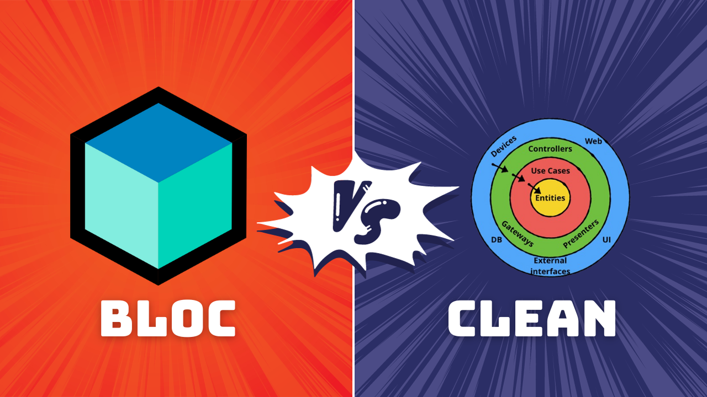

Clean architecture and BLoC architecture are two popular architectural patterns used in Flutter development. Both aim to create modular, maintainable, and testable applications, but they differ in their approach and usage.

## Clean Architecture

Clean architecture, also known as Uncle Bob's Clean Architecture, is a set of principles that aims to decouple the business logic of an application from its external dependencies, such as the user interface, database, and external APIs. This makes the code easier to test, maintain, and reuse.

### Key Principles of Clean Architecture

* **Dependency Inversion:** Entities should depend on abstractions, not on concretions.
* **Single Responsibility Principle:** Classes should have only one reason to change.
* **Open-Closed Principle:** Classes should be open for extension but closed for modification.
* **Interface Segregation Principle:** Many client-specific interfaces are better than one general-purpose interface.

### Layers of Clean Architecture

In Clean Architecture, the application is divided into three layers:

1. **Entities:** These represent the core business concepts and data models of the application.

2. **Use Cases:** These encapsulate the business rules and logic of the application. They interact with entities and repositories to perform specific tasks.

3. **Interfaces:** These define the boundaries between the layers and provide abstractions for communication between them.

## BLoC Architecture

BLoC architecture, on the other hand, is a state management pattern that uses streams to propagate state changes throughout the application. It is often used in conjunction with Clean Architecture to manage the flow of data and interactions between different layers.

### Key Components of BLoC Architecture

* **BLoC (Business Logic Component):** A class encapsulating business logic and exposing events and states.

* **Events:** Actions or inputs that trigger state changes in the BLoC.

* **States:** Representations of the current state of the application's data.

* **Streams:** Observables that emit state changes to subscribers.

### Layers of BLoC Architecture

In BLoC architecture, the application is divided into two main layers:

1. **Presentation Layer:** This is responsible for displaying the user interface and handling user interactions. It interacts with BLoC components to fetch and update the application's state.

2. **Business Logic Layer:** This encapsulates the business logic of the application and is implemented using BLoC components. It handles events from the presentation layer and updates the application's state accordingly.

## Comparison Table

| Feature | Clean Architecture | BLoC Architecture |
|---|---|---|
| Focus | Decoupling business logic from external dependencies | State management |
| Scope | Entire application | Specific components |
| Granularity | Coarse-grained (use cases) | Fine-grained (events and states) |
| Testing | Easy to test business logic in isolation | Easy to test state management logic |
| Maintainability | Highly maintainable due to decoupling | Maintainable due to clear separation of concerns |
| Reusability | Highly reusable business logic components | Reusable state management pattern |
| Use Cases | Suitable for complex applications with a lot of business logic | Suitable for applications with complex state management requirements |


Sure, here is a code example for the comparison of clean architecture and BLoC architecture in Flutter:

**Clean Architecture Example**

```jsx
// Entities
class Post {
  final int id;
  final String title;
  final String content;

  Post({required this.id, required this.title, required this.content});
}

// Use Cases
class GetPostsUseCase {
  final PostRepository postRepository;

  GetPostsUseCase({required this.postRepository});

  Future<List<Post>> execute() async {
    return await postRepository.getPosts();
  }
}

// Repositories
class PostRepository {
  final RemotePostDataSource remotePostDataSource;

  PostRepository({required this.remotePostDataSource});

  Future<List<Post>> getPosts() async {
    return await remotePostDataSource.getPosts();
  }
}

// Data Sources
class RemotePostDataSource {
  final HttpClient httpClient;

  RemotePostDataSource({required this.httpClient});

  Future<List<Post>> getPosts() async {
    // Make network request to fetch posts data
    // ...
  }
}
```

**BLoC Architecture Example**

```jsx
// Events
class GetPostsEvent {}

// States
class PostsLoadingState {}

class PostsLoadedState {
  final List<Post> posts;

  PostsLoadedState(this.posts);
}

class PostsErrorState {
  final String errorMessage;

  PostsErrorState(this.errorMessage);
}

// BLoC
class PostsBloc extends Bloc<GetPostsEvent, PostsState> {
  final GetPostsUseCase getPostsUseCase;

  PostsBloc({required this.getPostsUseCase}) : super(PostsLoadingState()) {
    on<GetPostsEvent>((event, emit) async {
      try {
        final posts = await getPostsUseCase.execute();
        emit(PostsLoadedState(posts));
      } catch (error) {
        emit(PostsErrorState(error.toString()));
      }
    });
  }
}
```

This example demonstrates the basic structure of Clean Architecture and BLoC Architecture in Flutter. Clean Architecture focuses on separating business logic (use cases) from external dependencies (repositories and data sources), while BLoC Architecture manages state changes using events and streams.

## Conclusion

Both Clean Architecture and BLoC Architecture offer advantages for building Flutter applications. Clean Architecture provides a structured approach to decoupling business logic and improving maintainability, while BLoC Architecture offers a powerful state management solution for complex applications. The choice of architecture depends on the specific requirements and complexity of the application. For large, complex applications with a lot of business logic, Clean Architecture is a good choice. For smaller applications with complex state management requirements, BLoC Architecture is a suitable option.
